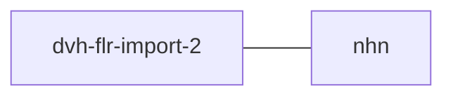

# dvh-flr-import

Application imports patient lists with a link to a fastlege via a web service towards
the fastlegeregistret offered by HDIR

## Technologies used
* Kotlin
* Ktor
* Gradle
* Junit

### Prerequisites
* JDK 21

Make sure you have the Java JDK 21 installed
You can check which version you have installed using this command:
``` bash
java -version
```

* Docker

Make sure you have docker installed
You can check which version you have installed using this command:
``` bash
docker --version
```

## FlowChart
This the high level flow of the application


## Getting started locally
### Build and run tests
To build and run testyou can simply run
``` shell
./gradlew clean build
```
or on windows
``` shell
gradlew.bat clean build
```
#### Compile and package application
To build  jar you can simply run
``` shell
./gradlew shadowJar
```
or on windows
``` shell
gradlew.bat shadowJar
```
This will create a shadowJar here in the following path:
```
build/libs/app-0.0.1.jar
```

### Upgrading the gradle wrapper
Find the newest version of gradle here: https://gradle.org/releases/ Then run this command:
Remember to change $gradleVersjon to the newest version of gradle, example: 8.10
``` shell
./gradlew wrapper --gradle-version $gradleVersjon
```